---
## Front matter
title: "Отчёт по девятой лабораторной работе"
subtitle: "По дисциплине Операционные Системы "
author: "Плугатар Илья Михайлович"
## Generic otions
lang: ru-RU
## Pdf output format
toc-depth: 2
fontsize: 12pt
linestretch: 1.5
papersize: a4
documentclass: scrreprt
## I18n polyglossia
polyglossia-lang:
  name: russian
  options:
	- spelling=modern
	- babelshorthands=true
polyglossia-otherlangs:
  name: english
## I18n babel
babel-lang: russian
babel-otherlangs: english
## Fonts
mainfont: PT Serif
romanfont: PT Serif
sansfont: PT Sans
monofont: PT Mono
mainfontoptions: Ligatures=TeX
romanfontoptions: Ligatures=TeX
sansfontoptions: Ligatures=TeX,Scale=MatchLowercase
monofontoptions: Scale=MatchLowercase,Scale=0.9
## Biblatex
biblatex: true
biblio-style: "gost-numeric"
biblatexoptions:
  - parentracker=true
  - backend=biber
  - hyperref=auto
  - language=auto
  - autolang=other*
  - citestyle=gost-numeric
## Pandoc-crossref LaTeX customizations
figureTitle: "Рис."
tableTitle: "Таблица"
listingTitle: "Листинг"
lofTitle: "Список иллюстраций"
lotTitle: "Список таблиц"
lolTitle: "Листинги"
## Misc options
indent: true
header-includes:
  - \usepackage{indentfirst}
  - \usepackage{float} # keep figures where there are in the text
  - \floatplacement{figure}{H} # keep figures where there are in the text
## date: "2022"
---
\
\
\
\

## Цели работы:

\

##  Задание:

1. Ознакомиться с теоретическим материалом.
2. Ознакомиться с редактором emacs.
3. Выполнить упражнения.
4. Ответить на контрольные вопросы.

## Выполнение задания:

1. Открываем emacs, создаём файл с помощью хоткей-комбинации C-x C-f. Набираем
предложенный текст.

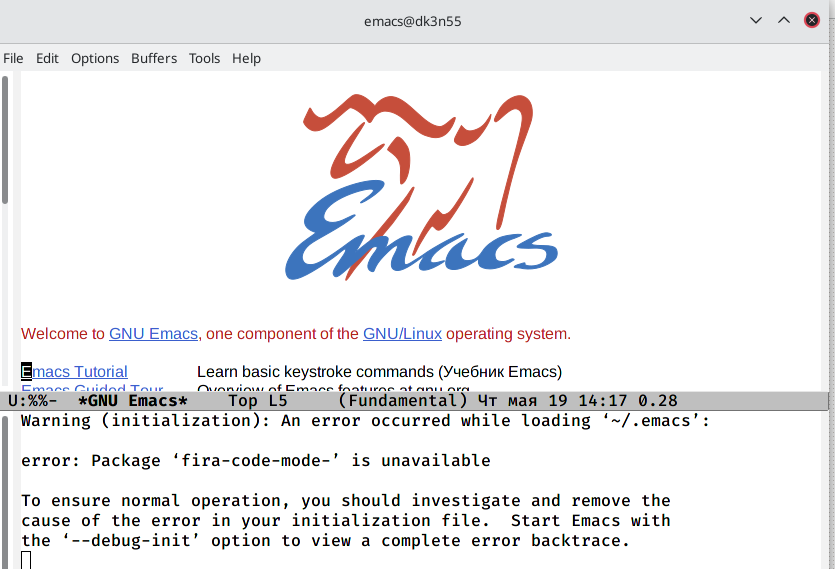{ #fig:001 width=70% }

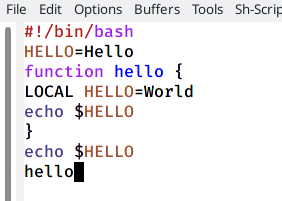{ #fig:002 width=70% }  

2. Сохраняем файл. Вырезаем строку (C-k), вставляем её в конец файла (C-y).

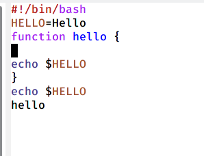{ #fig:003 width=70% }
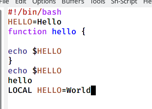{ #fig:004 width=70% }

3. Выделяем область текста (C-space, затем клавиши стрелок для перемещения
второй границы выделения).

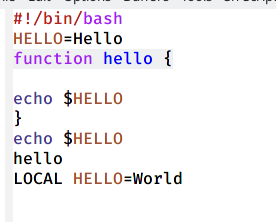{ #fig:005 width=70% }

4. Копируем выделенный текст (M-w) и вставляем в конец буфера.

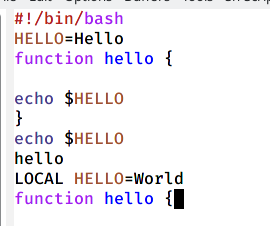{ #fig:006 width=70% }  

5. Выделяем область и вырезаем её, затем отменяем (C-/). Перемещаем курсор в
начало строки (C-a), затем в её конец (C-e).
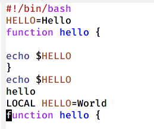{ #fig:007 width=70% }  

\

6. Перемещаем курсор в начало буфера, затем в конец (M-< и M->, или M-Home и
M-End соответственно).

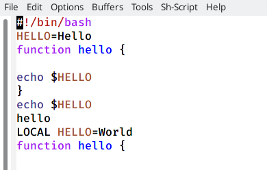{ #fig:008 width=70% }  
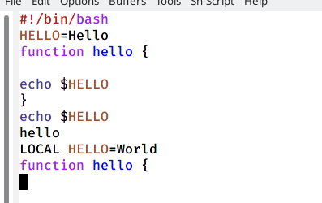{ #fig:009 width=70% }  

\

7. Выводим список активных буферов на экран (C-x C-b).

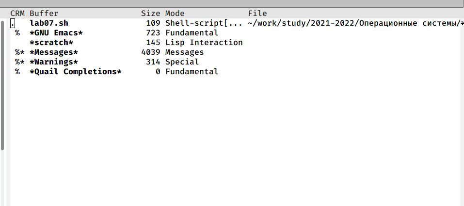{ #fig:010 width=70% }  

\

8. Делим фрейм на четыре окна (C-x 3, C-x 2 в каждом из получившихся двух).
Пишем новый текст в каждом из новых окон.

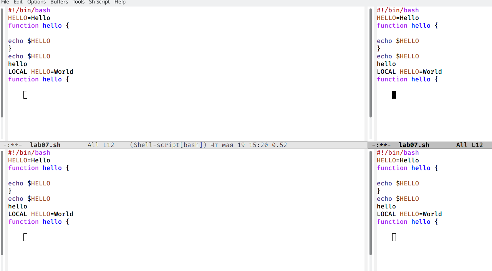{ #fig:011 width=70% }
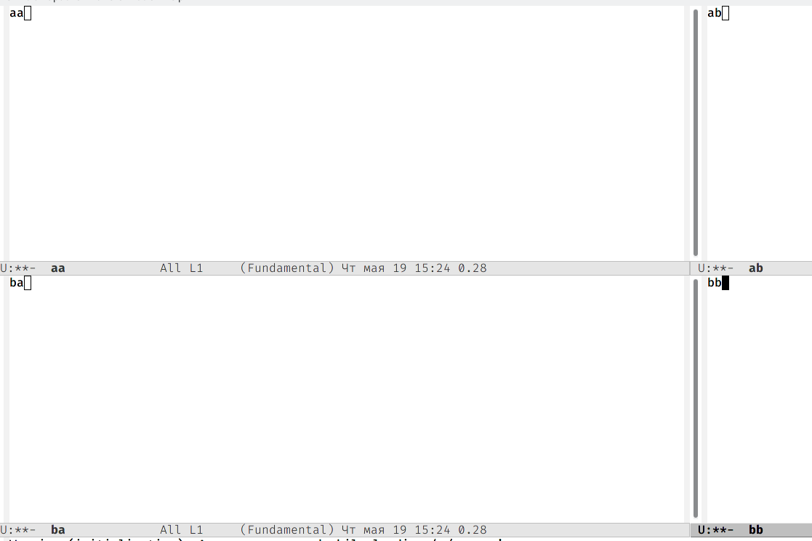{ #fig:012 width=70% }  

\

9. Используем режим поиска (C-s).

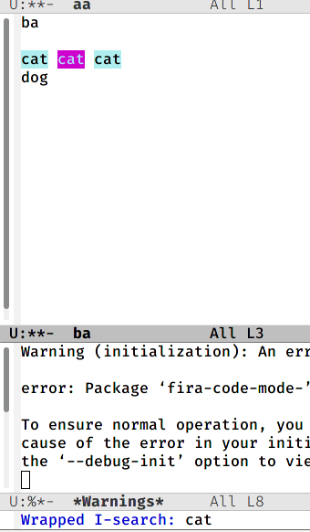{ #fig:013 width=70% }    

Пробуем другие способы поиска: поиск с заменой (M-%) и поиск после курсора (M-s).

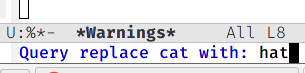{ #fig:014 width=70% }  

## Заключение  
\  
Мы получили практические навыки работы с редактором Emacs.  
