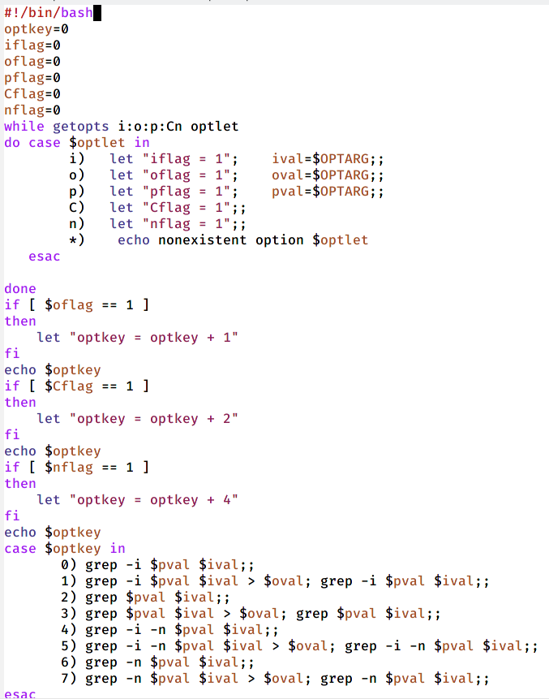
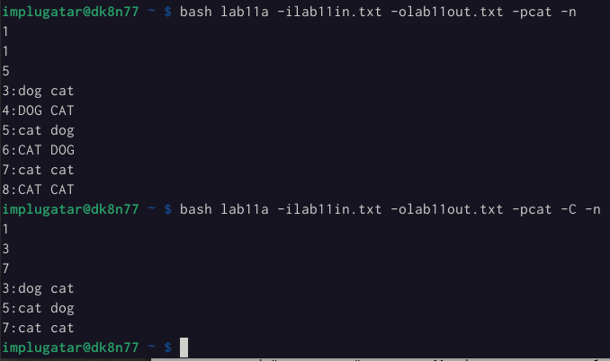
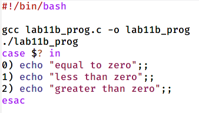
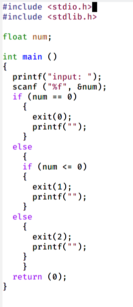
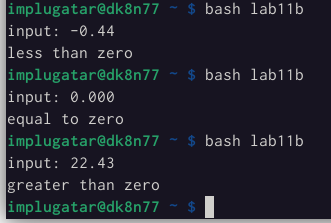
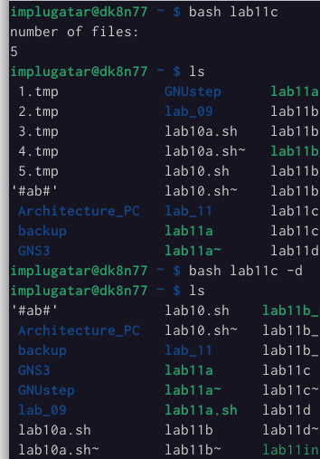
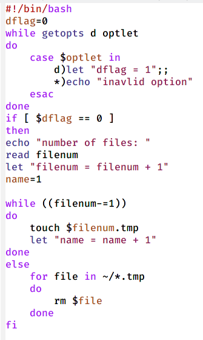
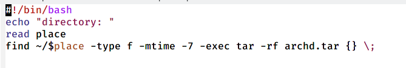

---
## Front matter
title: "Отчёт по одиннадцатой лабораторной работе"
subtitle: "По дисциплине Операционные Системы "
author: "Плугатар Илья Михайлович"
## Generic otions
lang: ru-RU
## Pdf output format
toc-depth: 2
fontsize: 12pt
linestretch: 1.5
papersize: a4
documentclass: scrreprt
## I18n polyglossia
polyglossia-lang:
  name: russian
  options:
	- spelling=modern
	- babelshorthands=true
polyglossia-otherlangs:
  name: english
## I18n babel
babel-lang: russian
babel-otherlangs: english
## Fonts
mainfont: PT Serif
romanfont: PT Serif
sansfont: PT Sans
monofont: PT Mono
mainfontoptions: Ligatures=TeX
romanfontoptions: Ligatures=TeX
sansfontoptions: Ligatures=TeX,Scale=MatchLowercase
monofontoptions: Scale=MatchLowercase,Scale=0.9
## Biblatex
biblatex: true
biblio-style: "gost-numeric"
biblatexoptions:
  - parentracker=true
  - backend=biber
  - hyperref=auto
  - language=auto
  - autolang=other*
  - citestyle=gost-numeric
## Pandoc-crossref LaTeX customizations
figureTitle: "Рис."
tableTitle: "Таблица"
listingTitle: "Листинг"
lofTitle: "Список иллюстраций"
lotTitle: "Список таблиц"
lolTitle: "Листинги"
## Misc options
indent: true
header-includes:
  - \usepackage{indentfirst}
  - \usepackage{float} # keep figures where there are in the text
  - \floatplacement{figure}{H} # keep figures where there are in the text
## date: "2022"
---
\
\
\
\

## Цели работы:

Изучить основы программирования в оболочке ОС UNIX. Научиться писать более сложные командные файлы с использованием логических управляющих конструкций и циклов.

\

## Выполнение задания:

1. 

Используя команды getopts и grep, пишем командный файл, который анализирует командную строку с ключами:
-iinputfile — прочитать данные из указанного файла;
-ooutputfile — вывести данные в указанный файл;
-pшаблон — указать шаблон для поиска;
-C —различать большие и малые буквы;
-n — выдавать номера строк.
а затем ищет в указанном файле нужные строки, определяемые ключом -p. В качестве основы используем конструкции while-do-done и case-in-esac. C помощью суммы ключей по степеням двойки делаем основную конструкцию case, где прописываем исполнение команд grep с разными опциями в зависимости от ключей командного файла.

{ #fig:001 width=70% }

{ #fig:002 width=70% }

\

2. Пишем на языке Си программу,которая вводит число и определяет, является ли оно больше нуля, меньше нуля или равно нулю. Затем программа завершается с помощью функции exit(n), передавая информацию в о коде завершения в оболочку. Командный файл должен вызывать эту программу и, проанализировав с помощью команды $?, выдать сообщение о том, какое число было введено.

{ #fig:003 width=70% }
{ #fig:004 width=70% }
{ #fig:005 width=70% }

\

3. Пишем командный файл, создающий указанное число файлов, пронумерованных последовательно от 1 до N (например 1.tmp, 2.tmp,3.tmp, 4.tmp и т.д.). Число файлов, которые необходимо создать, передаётся в аргументы командной строки. Этот же командный файл может удалять все созданные им файлы (если они существуют). Для создания и удаления файлов используем команду touch и команду rm соответственно.

{ #fig:006 width=70% }
{ #fig:007 width=70% }

\

4. Пишем командный файл, который с помощью команды tar запаковывает в архив все файлы в указанной директории. Модифицируем его так, чтобы запаковывались только те файлы, которые были изменены менее недели тому назад (использовать команду find).
Итоговый скрипт оформляем как команду find с опциями -mtime, которая создаёт временное ограничение пространства поиска, и -exec, которая вызывает архиватор tar.

{ #fig:008 width=70% }

\

## Заключение  
\  
Мы изучили основы программирования в оболочке ОС UNIX и научились писать более сложные командные файлы с использованием логических управляющих конструкций и циклов.
