---
## Front matter
title: "Отчёт по тринадцатой лабораторной работе"
subtitle: "По дисциплине Операционные Системы "
author: "Плугатар Илья Михайлович"
## Generic otions
lang: ru-RU
## Pdf output format
toc-depth: 2
fontsize: 12pt
linestretch: 1.5
papersize: a4
documentclass: scrreprt
## I18n polyglossia
polyglossia-lang:
  name: russian
  options:
	- spelling=modern
	- babelshorthands=true
polyglossia-otherlangs:
  name: english
## I18n babel
babel-lang: russian
babel-otherlangs: english
## Fonts
mainfont: PT Serif
romanfont: PT Serif
sansfont: PT Sans
monofont: PT Mono
mainfontoptions: Ligatures=TeX
romanfontoptions: Ligatures=TeX
sansfontoptions: Ligatures=TeX,Scale=MatchLowercase
monofontoptions: Scale=MatchLowercase,Scale=0.9
## Biblatex
biblatex: true
biblio-style: "gost-numeric"
biblatexoptions:
  - parentracker=true
  - backend=biber
  - hyperref=auto
  - language=auto
  - autolang=other*
  - citestyle=gost-numeric
## Pandoc-crossref LaTeX customizations
figureTitle: "Рис."
tableTitle: "Таблица"
listingTitle: "Листинг"
lofTitle: "Список иллюстраций"
lotTitle: "Список таблиц"
lolTitle: "Листинги"
## Misc options
indent: true
header-includes:
  - \usepackage{indentfirst}
  - \usepackage{float} # keep figures where there are in the text
  - \floatplacement{figure}{H} # keep figures where there are in the text
## date: "2022"
---
\
\
\
\

## Цели работы:

Приобрести простейшие навыки разработки, анализа, тестирования и отладки
приложений в ОС типа UNIX/Linux на примере создания на языке программирования С
калькулятора с простейшими функциями.

##  Задание:

Провести компиляцию и отладку программы с помощью стандартных средств
UNIX/Linux-систем.

## Выполнение задания:

1. Создаём подкаталог и файлы для компиляции. Компилируем файлы (с ключом -g для
правильности работы некоторых функция отладчика gdb.

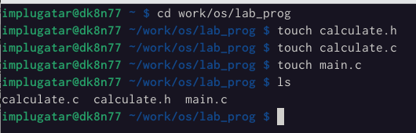
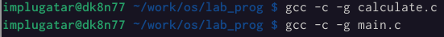
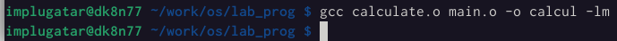

2. Создаём Makefile (пояснение содержания: компиляция файлов программы и
  очистка).

3. Запускаем дебаггер gdb.

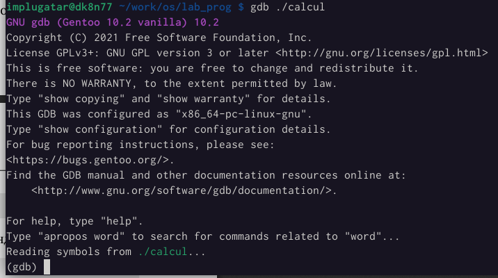

4. Запускаем программу внутри отладчика.

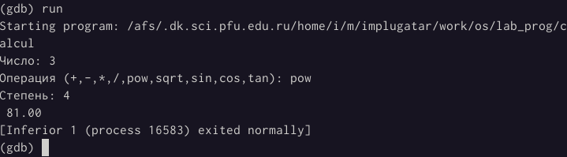

5. Используем команду list для просмотра кода. Для отображения конкретного
диапазона строк вводим команду с параметрами верхней и нижней границы отрывка
файла (см. изобр. ниже). Для отображения строк не основного файла указываем
в параметрах вторичный файл.

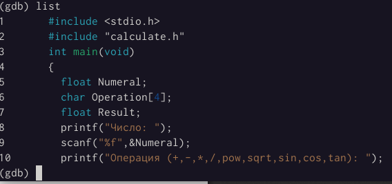
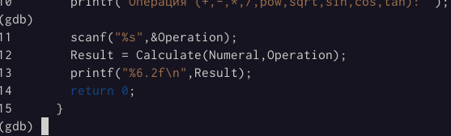
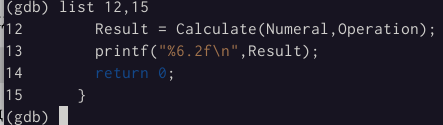
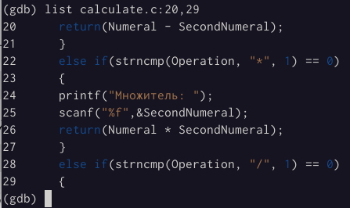

6. Размещаем точку останова (брейкпойнт) на строке 21, до момента ввода второго
аргумента.

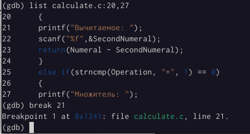

7. Запускаем программу для проверки правильности остановки программы. С помощью
команды backtrace выводим информацию об остановке. Отображаем значение Numeral
двумя способами. Убираем точки останова.

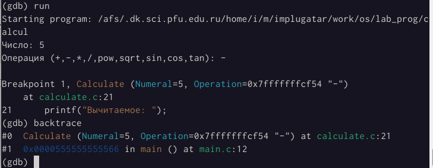
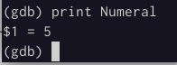
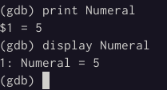
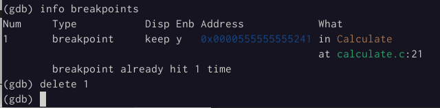

## Заключение

Мы приобрели простейшие навыки разработки, анализа, тестирования и отладки
приложений в ОС типа UNIX/Linux на примере создания на языке программирования С
калькулятора с простейшими функциями.
